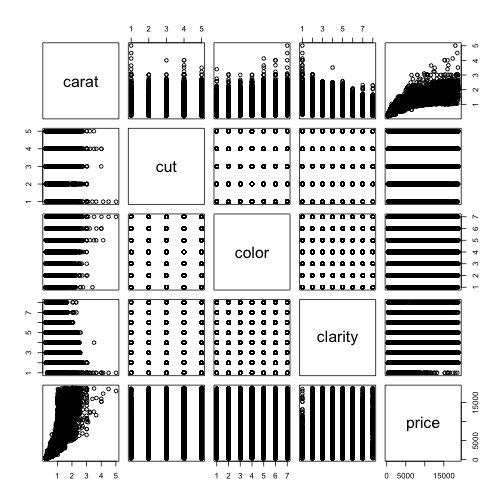

Developing Data Products - The Pitch
========================================================
author: John Plaxton
date: Oct. 28,2018
autosize: true
width: 1600
height: 900

Now What?
========================================================
You've been trolling around in the attic and stumbled across some heirloom jewelry.  You ask yourself "Wonder what the diamonds in the jewelry are worth?".  You have a jeweler assess the weight and grade of the diamonds, and he gives you a value.  How good is that number?  

Diamonds are valued based on the 4 C's:
- Carats: weight of the diamond (proportional to size)
- Cut: quality of the diamond from best to worst (Ideal, Premium, Very Good, Good, Fair)
- Color: best(D) to worst(J)
- Clarity: measures how clear the diamond is from best to worst (IF, VVS2, VVS1, VS2, VS1, SI2, SI1, I1)

The app presented here will predict diamond value from user selection of the 4 C's.  The diamond's 4 C's is compared to a database of over 50,000 other diamonds to come up with a value estimate.

Documentation
========================================================
Summary of the "diamonds" dataset found in the ggplot2 R package. Over 50,000 diamonds are included in the model for value prediction. A linear regression model is used to predict diamond value.

```
Classes 'tbl_df', 'tbl' and 'data.frame':	53940 obs. of  5 variables:
 $ carat  : num  0.23 0.21 0.23 0.29 0.31 0.24 0.24 0.26 0.22 0.23 ...
 $ cut    : Ord.factor w/ 5 levels "Fair"<"Good"<..: 5 4 2 4 2 3 3 3 1 3 ...
 $ color  : Ord.factor w/ 7 levels "D"<"E"<"F"<"G"<..: 2 2 2 6 7 7 6 5 2 5 ...
 $ clarity: Ord.factor w/ 8 levels "I1"<"SI2"<"SI1"<..: 2 3 5 4 2 6 7 3 4 5 ...
 $ price  : int  326 326 327 334 335 336 336 337 337 338 ...
```

Summary plot of the diamond data with each of the relevant variables plotted against each other
========================================================


Links
========================================================
- shiny app: https://jplaxton.shinyapps.io/DataProducts/
- source code: https://github.com/jplaxton/DataProducts
